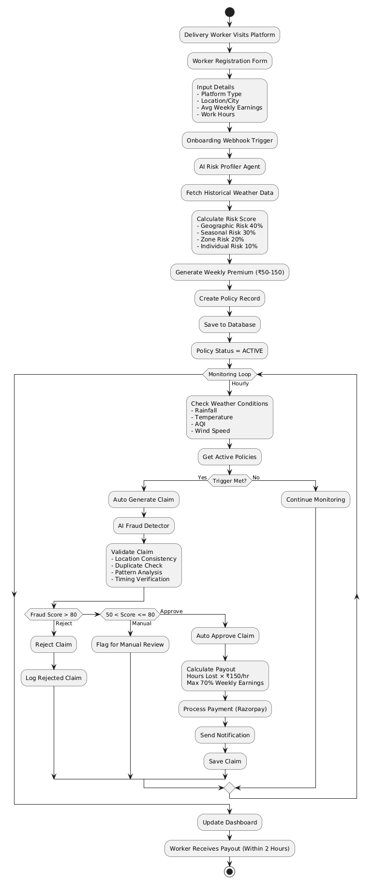
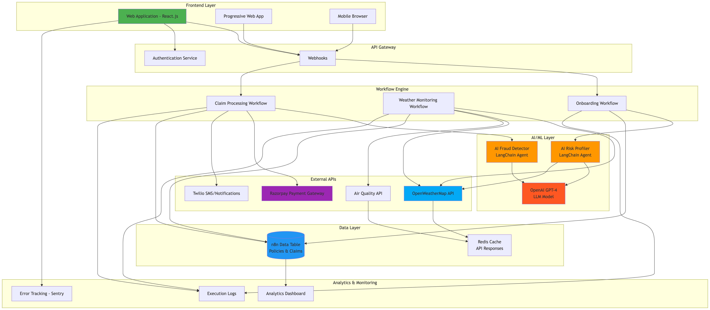

# 🚀 GigShield – AI-Powered Parametric Insurance for Gig Workers

**Phase:** 1 (Ideation & Foundation)  
**Status:** Workflows Implemented, Frontend Pending  
**Last Updated:** March 2024

---

## 📌 Overview

**GigShield**, an AI-based parametric insurance service, helps gig workers, particularly food delivery drivers, protect their income against loss that occurs due to external events such as extreme weather conditions, air pollution, or regulatory restrictions.

GigShield is different than traditional forms of insurance because they use **parametric triggers** to automatically detect when a disruption has happened and to **pay out instantly** without the need for a manual claim process.

---

## 🎯 Problem Statement

Gig workers, such as delivery people, deal with:

- 🌧️ Income loss due to weather disruptions
- ⏱️ Work that has strict time requirements and then the weather also affects that work
- 📉 No safety net financially that they can rely on
- 🚫 The process of getting a traditional insurance payout that is very complicated and that takes a long time to get paid

---

## 💡 Solution

GigShield can provide:

- the whole claim process is automated, no paperwork, etc.
- analyzes the risk of the gig worker and finds out who is a fraud
- payout for lost gig income within two hours
- Micro insurance paid weekly that aligns with gig income

---

## 👤 Target Persona

### Food Delivery Partners (Zomato / Swiggy)

**Why did we target this group – food delivery partner?:**

- In general, food delivery partners are exposed to a lot of different environmental risks.
- When there are peak earning hours for food delivery (when the conditions are most likely to cause disruptions to earning), food delivery partners are out working.
- Therefore food delivery requires mobility outdoors – real-time.

---

## 📖 Persona-Based Scenarios

### 🌧️ Scenario 1: Extreme Weather

- **Person:** Rajesh 28 Mumbai
- **Trigger:** Rainfall exceeding 50 millimeters sustained for three hours during the 6-10pm hours
- **Manner in which or amount of earnings they will lose:** Rajesh will lose between ₹800 to ₹1200.
- **How he will respond to losing money (claims):** 70% automated payout will occur automatically at the time of claim.

---

### 🌫️ Scenario 2: Severe Air Pollution

- **Person:** Priya 32 Delhi
- **Trigger – Air Quality Index:** 400+
- **Work lost:** Lost four to six hours of work due to poor air quality.
- **Claims to receive:** Will receive hour amount claimed for lost time to work caused by poor air quality.

---

### 🚧 Scenario 3: Local Disruption

- **Person:** Amit 25 Bangalore
- **Trigger:** Curfew or travel restrictions in his area.
- **How many earnings will he lose:** ₹1500 daily
- **How he will receive the claim:** Cash payout based on area in which events occur.

---

## 🔄 Application Workflow

### 1️⃣ Onboarding Phase

- Register worker (platform, location, earnings)
- AI-driven risk assessment
- Calculate weekly premium
- Activate policy

---

### 2️⃣ Monitoring Phase

- ⏱️ Hourly tracking of:
  - Weather
  - AQI
  - Location accessibility
- Parametric trigger evaluation

---

### 3️⃣ Claim Phase

1. Automatic trigger detection
2. Fraud validation (AI + rules)
3. Claim approval
4. 💸 Instant payout

## 🔄 End-to-End Workflow Diagram

This diagram illustrates the complete lifecycle from onboarding to automated claim payout.



---

## ⚙️ System Architecture

### A. Onboarding & Risk Assessment

**Inputs:**

- Location
- Platform type
- Weekly earnings
- Work hours

**Processing:**

- Historical weather analysis
- Risk scoring

**Output:**

- Weekly premium (₹50–150)

## 🏗️ System Architecture Diagram

The following diagram shows the high-level architecture of GigShield, including frontend, workflows, AI layer, and integrations.



---

### B. Parametric Monitoring

**Tracked Parameters:**

| Parameter   | Threshold    |
| ----------- | ------------ |
| Rainfall    | >30 mm/hour  |
| Temperature | >42°C / <5°C |
| AQI         | >300         |
| Wind Speed  | >40 km/h     |

---

### C. Automated Claims Logic

```text
IF (Weather > Threshold)
AND (Worker in affected zone ±500m)
AND (Active during working hours)
AND (Policy active)
THEN Trigger Claim
```

---

## 💰 Weekly Premium Model

### Formula

```
Weekly Premium = (Weekly Earnings × Risk Score × Coverage %) / 52
```

### Example

- Earnings: ₹7000
- Risk Score: 0.15
- Coverage: 70%

➡️ Premium ≈ ₹101/week

---

### Risk Factors

- 🌍 Geographic Risk (40%)
- 🌦️ Seasonal Risk (30%)
- 🏙️ Zone Risk (20%)
- 👤 Individual Risk (10%)

---

### Premium Tiers

| Risk Level | Premium  | Coverage |
| ---------- | -------- | -------- |
| Low        | ₹50–75   | 70%      |
| Medium     | ₹76–125  | 70%      |
| High       | ₹126–150 | 70%      |

---

## ⚠️ Payout Constraints (Sustainability)

To maintain viability in long run, the following must hold true:

- Maximum payout per event= ₹500-700.
- Maximum weekly payout= ₹1500.
- Target loss ratio= 60-70%

---

## 📊 Parametric Trigger Framework

| Trigger Type | Threshold | Payout    |
| ------------ | --------- | --------- |
| Heavy Rain   | >30 mm/hr | ₹150/hr   |
| Extreme Heat | >42°C     | ₹150/hr   |
| Pollution    | AQI >300  | ₹150/hr   |
| High Winds   | >40 km/h  | ₹150/hr   |
| Zone Closure | Boolean   | ₹1200/day |

---

## 🤖 AI/ML Integration

### 1. Risk Profiling

- Evaluating by AI:
  - Historical weather data
  - Location specific risks
- Provide custom premium estimates

---

### 2. Fraud Detection

Detects:

- 📍 Discrepancies in location
- 🔁 Duplicate submissions
- ⏰ Incorrect timeframes
- 📊 Deviating patterns of behaviours

**Reasoning:**

- If the fraud risk score (≥80) = report as fraud.
- If the fraud risk score (50 to 80) = manual verification.
- If the fraud risk score (≤50) = approved.

---

### 3. AI Functionality (Enhanced)

- Provide:
  - Insight
  - Identify anomalies
- All key determinations will continue to be **rule-based** for dependability.

---

## 🧠 Intelligent Advisory Function (Future)

- Predict future risks.
- Recommend:
  - Early start times.
  - Change zones (customer works).
  - Temporarily suspension of policies.

---

## 🌐 Platform Choice

### Web Application (PWA)

**Reasons for Web-first?**

- Installation not required.
- Faster delivery.
- Lower cost.
- Suitable for lower-end devices.

**Principles:**

- Access off-line.
- Employment of push notifications.
- Mobile friendly.

---

## 🛠️ Technology Stack

### Frontend

- React.js + TypeScript
- Tailwind CSS + shadcn/ui

### Backend

- n8n (workflow automation)

### AI

- OpenAI GPT (via LangChain)

### Database

- n8n Data Tables (MVP)
- PostgreSQL (future)

### APIs

- Weather: OpenWeatherMap
- AQI: IQAir / CPCB

### Payments

- Razorpay

### Notifications

- Twilio / Firebase

### DevOps

- Vercel
- GitHub Actions
- Sentry

---

## 📆 Development Plan

### ✅ Weeks 1–2 (Completed)

- Workflow documentation.
- AI installation/integration.
- Parametric triggers.
- Database design.

---

### 🚧 Weeks 3–4

- React front-end.
- User dashboard.
- API integration.

---

### 🔜 Weeks 5–6

- Testing.
- Optimization.
- Documentation.
- Demonstrate.

---

## 📁 Repository Structure

```
├── README.md
├── workflows/
│ ├── onboarding.json
│ ├── monitoring.json
│ └── claims.json
├── frontend/
├── docs/
└── tests/
```

---

## 📈 Unit Economics (Sample)

- Users = 1000
- Average Premium = ₹100/week = ₹1,00,000
- Anticipated Claims = ₹60,000

* Profit = ₹40,000

---

## 🏆 Key Differentiators

- ⚡ Instant payouts
- 🤖 AI-assisted system
- 📅 Weekly micro-payments
- 🔒 Fraud-resistant
- 📊 Transparent triggers

---

## 📊 Success Metrics

### Phase 1

- Workflow will be fully automated at 100%
- Utilization of dynamic pricing
- Five or more different trigger conditions will be available

---

### Post Launch

- Claims will be processed in less than 2 hours on average
- Claim accuracy will be greater than 95%
- Onboarding of new policyholders will take no longer than 5 minutes to complete

---

## ⚠️ Risks & Mitigation

| Risk                 | Mitigation                                                                     |
| -------------------- | ------------------------------------------------------------------------------ |
| API limits           | Cache client responses and use multiple APIs                                   |
| False-based triggers | Implement validation layers to avoid false triggers                            |
| Fraud                | Artificial intelligence (AI) and rule checks will help to reduce fraud         |
| Low adoption         | Provide user incentives to drive adoption                                      |
| Data errors          | Use multiple sources for verification prior to loading data into the platform. |

---

## 🏛️ Regulatory Consideration

- Will be compliant with IRDAI guidelines
- May consider use of a regulatory sandbox or partnership with insurers in lieu of receiving licensing

---

## 🚀 Future Roadmap

- Integrate into multi-platforms (Zomato/Swiggy)
- Consider expansion into:
  - Ride-hailing drivers
  - Construction workers
- Use of Predictive Analytics
- Development of mobile applications

---

## 📬 Next Steps

1. Pilot program with 50 initial users
2. Validate Financials
3. Consult with appropriate Regulatory Agencies
4. Develop partnerships with potential platform partners

---

## 📌 Project Info

**Project Name:** GigShield  
**Type of Project:** AI, FinTech and InsurTech  
**Stage:** MVP Development

---
